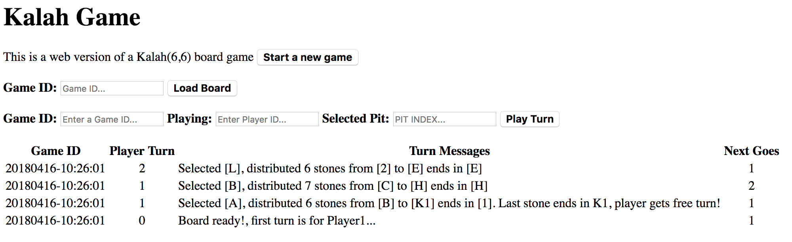
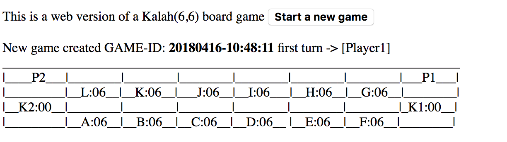
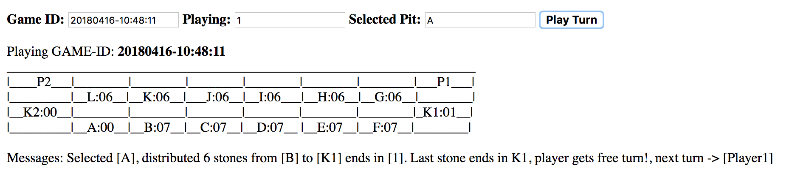

# Kalah Board Game
[](https://travis-ci.org/twogg-git/ci-teamcity)

Paying around with Java and a Kalah(6,6) game.

The general rules of the game are explained on Wikipedia: https://en.wikipedia.org/wiki/Kalah. 

## Basics

- 6 Pits per player
- 6 Stones by pit
- 1 Kalah per player
- 2 Players

## Board
      < ---- Player 2 turn direction       
| Player2 |   |   |   |   |   |   | Player2 |
|---------|---|---|---|---|---|---|---------|
|         | L | K | J | I | H | G |         |
|   K2    |   |   |   |   |   |   |   K1    |
|         | A | B | C | D | E | F |         |
       Player 1 turn direction ---- >

Player 1 Kalah's is position K1, his pits are A-F

Player 2 Kalah's is position K2, his pits are G-L

## How to play

- Always move counter-clockwise
- Start your turn only in your pits
- Always take all your selected pit's stones and distribute each one in the adyecent pits including your Kalah


## Rules

- If your last stone ends in your Kalah you get another turn
- If your last stone ends in an empty pit and your oposite pit had stones, you take his pit stones and yours to your Kalah 
- If a player had all his pits empty the oposite player take the remaining stones to his Kalah and the game ends
- At the game endings you count all your Kalah stones and the player with more stones wins

## Rest Services

- POST /new-board -> Init a new board and creates its logs info.
- POST /play?game_id=?&player_id=?&pit_id=? -> Plays a turn, also draws the new board status.  
- GET  /load-board?load_game_id=? -> Draws an hmlt board status by game id.
- GET  /logs -> Load pevious games logs and shows current plays.

## Run the game

In your terminal go to projects folder, then execute docker-compose up --build command 
```ssh
$ docker-compose up --build
```

Then in your browser open
```ssh
http://localhost:8080/
```





